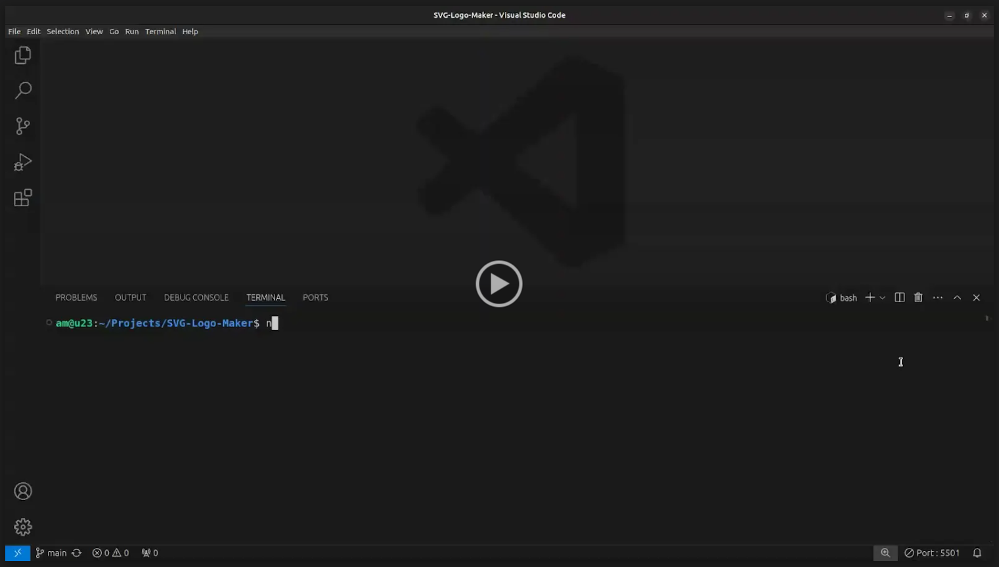

# SVG Logo Maker


## Description

SVG Logo Maker is a command-line application that allows users to create custom SVG logos. Users can input up to three characters of text, choose text and shape colors, and select from a list of shapes (circle, triangle, or square). The application generates an SVG file based on the user's input and saves it as logo.svg.

## Table of Contents

- [Installation 🚀](#installation)
- [Usage 🏗️](#usage)
- [Video Demonstration 📹](#video-demonstration)
- [Tests ✅](#tests)
- [Contributing 🤝](#contributing)
- [License 📄](#license)
- [Questions ❓](#questions)

## Installation 🚀

1. Clone the Repository:

```sh
git clone https://github.com/A-MOHAMED14/svg-logo-maker.git
```

2. Navigate to the Project Directory:

```sh
cd svg-logo-maker
```

3. Install dependencies:

```sh
npm install
```

## Usage 🏗️

1. Run the Application:

```sh
node index.js
```

2. Follow the Prompts:

```
- Enter up to three characters for the text.
- Enter the text color (keyword or hexadecimal).
- Choose a shape (circle, triangle, or square).
- Enter the shape color (keyword or hexadecimal).
```

3. Check the Output:

- The application will generate an SVG file named `logo.svg` in the project directory.
- Open `logo.svg` in a browser to view the custom logo.

## Video Demonstration 📹

Below is a video walk through demonstrating the functionality of this project:

<a href="https://drive.google.com/file/d/1xP3EabGws-BC8aGjYI5Ev2V4jeeK2wwu/view">
  
</a>

## Contributing 🤝

1. Fork the repository.
2. Create a New Branch:

```sh
git checkout -b feature/your-feature-name
```

3. Make your changes.

4. Commit Your Changes:

```sh
git commit -m "Descriptive message about your changes"
```

5. Push to the Branch:

```sh
git push origin feature/your-feature-name
```

6. Open a Pull Request.

## Tests ✅

1. Run Tests with Jest:

- Ensure you have Jest installed:

```sh
npm install --save-dev jest
```

- Run the tests:

```sh
npm test
```

2. Test Files:

- The test files are located in the lib directory and include shapes.test.js.
- The tests check the functionality of the `Triangle`, `Circle`, and `Square` classes, including the `render` method and color setting.

## License 📄

This project is licensed under the MIT License. You are free to use, copy, modify, merge, publish, distribute, sublicense, and/or sell copies of the software, provided that the original copyright notice and permission notice are included in all copies or substantial portions of the software. For more details, see the MIT [LICENSE](https://opensource.org/licenses/MIT) file.

## Questions ❓

If you have any questions about the project, please feel free to contact me directly:

GitHub: <a href="https://github.com/A-MOHAMED14">A-MOHAMED14</a>

Email: <a href="mailto:amin800@hotmail.co.uk">amin800@hotmail.co.uk</a>
